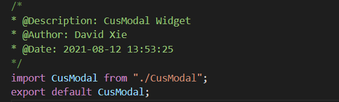

## 设置用户代码段

此次以配置JavaScript的用户代码代码段为例，在vs code左下角的**设置**中点击**用户代码段**，搜索*javascript.json*，在打开的文件中输入以下内容

```json
{
    "Print to create": {
        "prefix": "create",
        "body": [
            "/*",
            "* @Description: $0",
            "* @Author: David Xie",
            "* @Date: $CURRENT_YEAR-$CURRENT_MONTH-$CURRENT_DATE $CURRENT_HOUR:$CURRENT_MINUTE:$CURRENT_SECOND",
            "*/"
        ],
        "description": "a create mode"
    }
}
```

示例效果如下：



